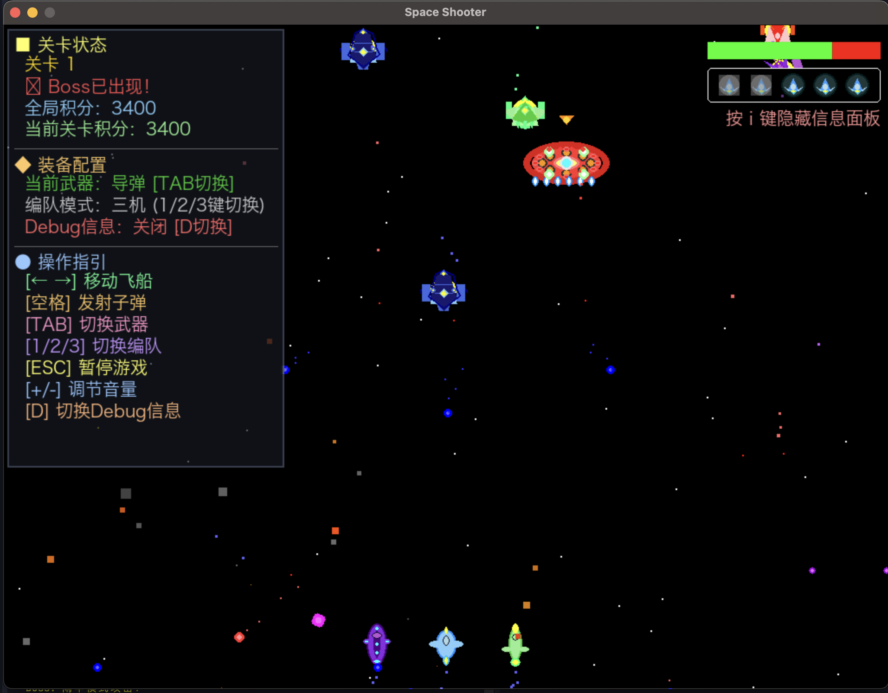

# 太空射手游戏

一个使用 Python 和 Pygame 开发的单人太空射击游戏，支持中文界面。

## 游戏特色

- 🚀 经典的太空射击游戏体验
- 🎮 多种飞船可选择
- 🔫 不同类型的武器和道具
- 🎯 敌人AI和Boss战斗
- 🇨🇳 完整的中文界面支持
- 🎵 背景音乐和音效
- 🔊 **程序化生成的武器音效** - 光束和导弹武器使用Python算法实时生成独特音效

## 游戏界面预览



*游戏主界面展示 - 中文菜单系统，飞船选择，以及现代化的游戏UI设计*

## 系统要求

- Python 3.11 或更高版本
- 推荐使用 `uv` 包管理器

## 安装依赖

### 使用 uv（推荐）

```bash
# 安装 uv（如果还没有安装）
curl -LsSf https://astral.sh/uv/install.sh | sh

# 安装项目依赖
uv sync
```

### 手动添加依赖

如果需要添加新的依赖包，使用：

```bash
# 添加新依赖
uv add package_name

# 例如添加新的游戏库
uv add pygame-gui
```

## 运行游戏

```bash
# 使用 uv 运行
uv run game.py

# 或者激活虚拟环境后运行
python game.py
```

## 游戏操作

### 基本控制
- **方向键** ← → : 移动飞船
- **空格键**: 发射子弹
- **Enter**: 开始游戏
- **ESC**: 暂停游戏/退出游戏

### 战斗控制
- **TAB键**: 切换武器类型
- **1/2/3键**: 切换编队模式（单机/双机/三机）
- **-/+键**: 调整音量

## 游戏玩法

1. 在主菜单选择你的飞船
2. 使用方向键控制飞船移动
3. 发射子弹消灭敌人
4. 收集道具提升能力
5. 避免与敌人碰撞
6. 挑战更高的分数！

## 项目结构

```
SpaceShooter/
├── game.py              # 主游戏逻辑
├── menu.py              # 菜单系统
├── sprites.py           # 游戏对象（飞船、子弹、敌人等）
├── sound_generator.py   # 音效程序化生成器
├── resources/           # 游戏资源
│   ├── fonts/          # 中文字体文件
│   └── sounds/         # 音效文件（包含程序生成的音效）
├── pyproject.toml       # 项目配置
└── README.md           # 项目说明
```

## 技术亮点

### 🎼 程序化音效生成
游戏使用自主开发的音效生成器，通过数学算法实时创建武器音效：

- **光束武器**：使用高频载波调制和频率扫描，创造科幻感的"能量光束"音效
- **导弹武器**：通过多阶段音效合成（发射轰鸣 → 飞行音 → 撞击爆炸），模拟完整的导弹发射过程
- **技术实现**：基于NumPy的波形生成、ADSR包络控制、噪音合成和简单滤波

所有音效都是使用Python代码实时生成，无需外部音频文件，展示了程序化内容生成的可能性。

## 开发

查看 `CLAUDE.md` 文件了解详细的开发指南和项目架构。

## 许可证

MIT License